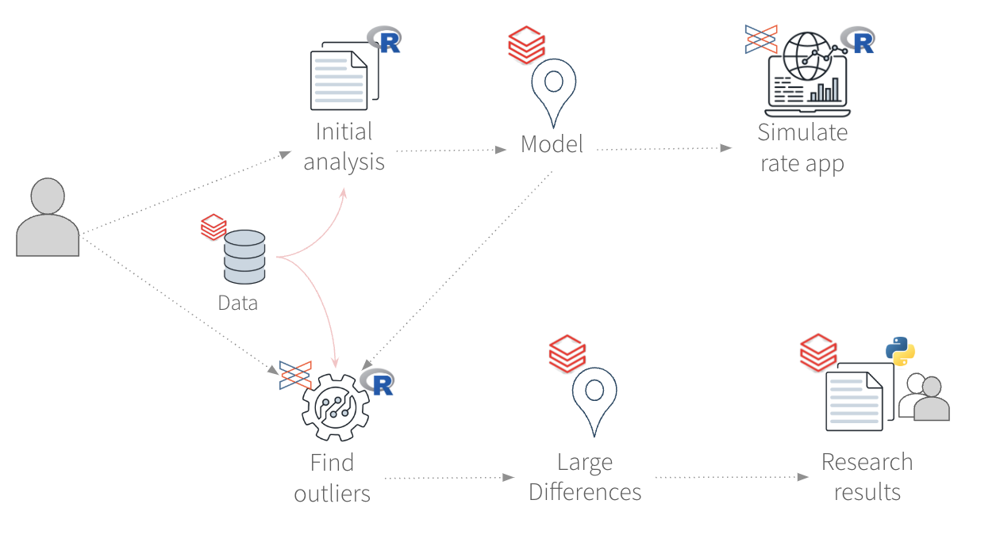

# Databricks + `pins`

## End-to-end workflow demo

-   [Analysis using Databricks tables, pins and Spark](https://pub.current.posit.team/public/end-to-end/spark-pin/databricks-pins-spark.html) (source: `doc-spark`)

-   [Automated job to find interest rate gaps](https://pub.current.posit.team/public/end-to-end/etl-job/spark-job.html) (source: `doc-etl`)

-   [Shiny application that uses the fitted model](https://pub.current.posit.team/public/end-to-end/app/) (source: `app-model`)

-   [Presentation deck](https://github.com/edgararuiz/talks/blob/main/end-to-end/presentation/end-to-end-databricks-pins.pdf) (source: `presentation`)
