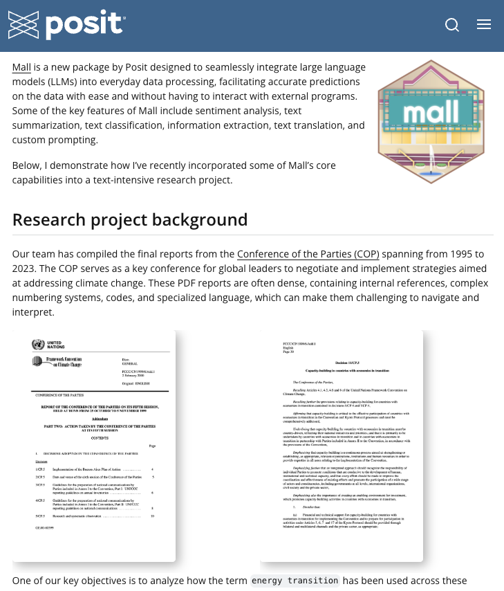
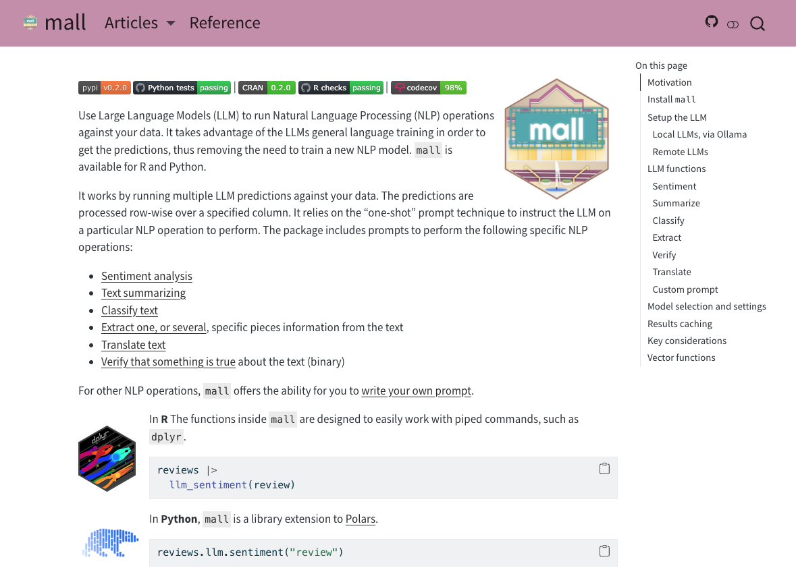
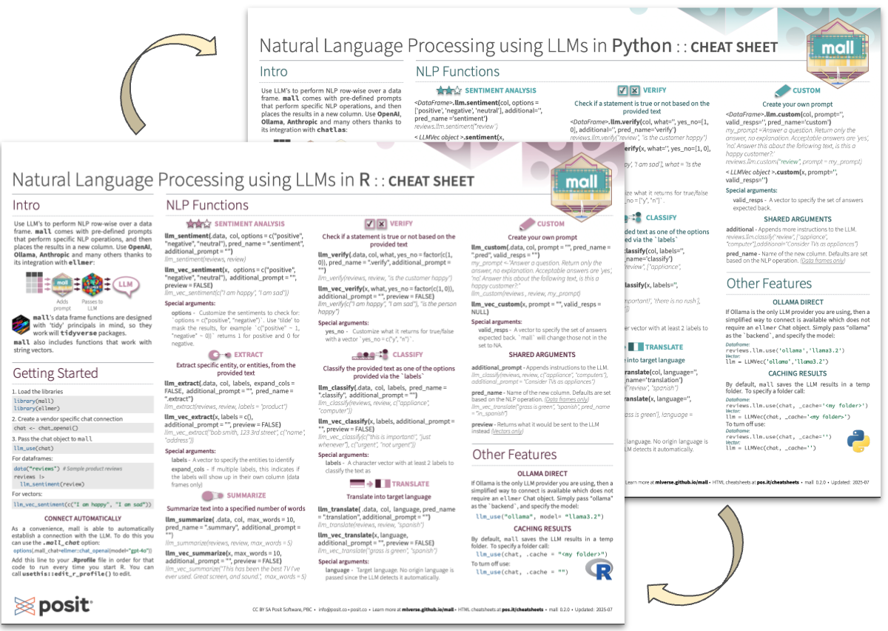

## Typical NLP project

:::{.incremental style="padding-left: 2em;"}
- Collect and **label** training data
- Choose and **fit** a model
- Tune, validate, tune again
- Repeat for every new language or task
:::


. . .

:::{.incremental style="padding-left: 6em;"}

*What if we could skip all of that?*
:::

---

## What is `mall`?

{.absolute top="90" right="10" width="90"}
{.absolute top="190" right="10" width="90"}

:::{style="padding-right: 120px;"}
`mall` lets you apply **LLMs as a function** across every row of your data


:::{.incremental style="padding-left: 2em;"}
- No model training
- No labeling pipeline
- Works with any language the LLM is trained on (English, Spanish, etc.)
- Familiar `dplyr`-style syntax
:::

:::

---

## How it works

The LLM reads each row and returns a structured result, **no training required**.

```{r}
#| eval: false

library(mall)

reviews |>
  llm_sentiment(review)
#> # A tibble: 3 × 2
#>   review                                      .sentiment
#>   <chr>                                       <chr>
#> 1 This product is amazing!                    positive
#> 2 Arrived broken, very disappointed           negative
#> 3 It works, nothing special                   neutral
```

---

## How it works: System prompt

For providers that support it, instructions are passed as the system prompt and the row data as the user message:

::: {style="background-color: #f5eef1; border-left: 4px solid #5b2942; padding: 0.6em 0.8em; font-size: 0.8em; font-family: monospace; border-radius: 4px; margin-top: 0.5em;"}
**System:** You are a helpful sentiment engine. Return only one of the following answers: positive, negative, neutral. No capitalization. No explanations.
:::

::: {style="background-color: #eee; border-left: 4px solid #c27ba0; padding: 0.6em 0.8em; font-size: 0.8em; font-family: monospace; border-radius: 4px; margin-top: 0.5em;"}
**User:** The answer is based on the following text:\
This product is amazing!
:::

---

## How it works: Single-shot prompt

For providers without system prompt support, instructions and data are concatenated into one message:

::: {style="background-color: #f5eef1; border-left: 4px solid #5b2942; padding: 0.6em 0.8em; font-size: 0.8em; font-family: monospace; border-radius: 4px; margin-top: 0.5em;"}
You are a helpful sentiment engine. Return only one of the following answers: positive, negative, neutral. No capitalization. No explanations. The answer is based on the following text:\
This product is amazing!
:::

---

## Setup {background-color="#5b2942" style="text-align: right;"}

---

## Setting up: Local Models

{.absolute top="90" right="10" width="90"}

:::{style="padding-right: 120px;"}
**Ollama** is a free tool that runs LLMs locally on your machine.
Supports Windows, Mac, and Linux.
:::

:::{style="padding-left: 1em;"}
1. Download and install [Ollama](https://ollama.com/download)

2. Pull a model from R:

:::{style="padding-left: 1em;"}
```{r}
ollamar::pull("llama3.2")  # ollamar is installed with mall
```
:::

3. Use it with `mall`:

:::{style="padding-left: 1em;"}
```{r}
library(mall)

llm_use("ollama", "llama3.2")
```
:::
:::


:::{style="padding-left: 4em;"}
Your data **never leaves your machine** ✓
:::

---

## Llama 3.2

{.absolute top="90" right="10" width="90"}

:::{style="padding-right: 120px;"}
Meta's Llama 3.2 is small enough to run locally, 
and capable enough for NLP tasks. And it is available for download in Ollama.
:::

:::{style="padding-left: 1em;"}
- Available in **1B** (1.3GB) and **3B** (2.0GB) parameter sizes
- Officially supports **8 languages:**
  English, German, French, Italian, Portuguese, Hindi, Spanish, and Thai
- Trained on a broader set of languages beyond the official 8
:::

:::{style="padding-left: 6em;"}
[ollama.com/library/llama3.2](https://ollama.com/library/llama3.2)
:::

---

## Setting up: Remote APIs

{.absolute top="90" right="10" width="90"}

:::{style="padding-right: 120px;"}
Use `ellmer` to connect to OpenAI, Anthropic, Google Gemini, and more
:::

```{r}
install.packages("ellmer")

library(mall)
library(ellmer)

chat <- chat_openai(model = "gpt-4o")
llm_use(chat)
```

---

## Setting a session default

Add to your `.Rprofile` to set a default for every session:

:::{style="padding-left: 1em;"}
- Remote model:

:::{style="padding-left: 1em;"}
```{r}
options(.mall_chat = ellmer::chat_openai(model = "gpt-4o"))
```
:::

- Local Ollama model:

:::{style="padding-left: 1em;"}
```{r}
options(.mall_chat = ellmer::chat_ollama(model = "llama3.2"))
```
:::
:::

---

## Local vs. Remote

|                  | Local (Ollama) | Remote (`ellmer`) |
|------------------|:--------------:|:---------------:|
| Data privacy     | ✓              | Depends on provider |
| Speed            | Slower         | Faster          |
| Cost             | Free           | Per API call    |
| Model quality    | Good           | Great           |
| Setup            | Install app    | API key         |

---

## Available functions {background-color="#5b2942" style="text-align: right;"}

---

## The `reviews` dataset

`mall` ships with a small built-in dataset to explore functions

```{r}
library(mall)

reviews
#> # A tibble: 9 × 1
#>   review
#>   <chr>
#> 1 This has been the best TV I've ever used. Great screen…
#> 2 I regret buying this laptop. It is too slow and the batt…
#> 3 Not sure how to feel about my new washing machine. It is…
#> # ℹ 6 more rows
```

---

## `llm_sentiment()`

Classify text as **positive**, **negative**, or **neutral**

```{r}
reviews |>
  llm_sentiment(review)
#> # A tibble: 9 × 2
#>   review                                          .sentiment
#>   <chr>                                           <chr>
#> 1 This has been the best TV I have ever used…     positive
#> 2 I regret buying this laptop…                    negative
#> 3 Not sure how to feel about my new washing…      neutral
```


Use custom labels:
```{r}
reviews |>
  llm_sentiment(review, options = c("happy", "sad", "meh"))
```

---

## `llm_summarize()`

Condense long text into a short summary

```{r}
reviews |>
  llm_summarize(review, max_words = 5)
#> # A tibble: 9 × 2
#>   review                                        .summary
#>   <chr>                                         <chr>
#> 1 This has been the best TV I've ever used…     this tv is excellent quality
#> 2 I regret buying this laptop…                  regrets buying slow laptop
#> 3 Not sure how to feel about my new washing…    confused about the purchase
```

---

## `llm_classify()`

Assign each row to one of your **predefined categories**

```{r}
reviews |>
  llm_classify(review, labels = c("appliance", "computer", "tv"))
#> # A tibble: 9 × 2
#>   review                                        .classify
#>   <chr>                                         <chr>
#> 1 This has been the best TV I've ever used…     tv
#> 2 I regret buying this laptop…                  computer
#> 3 Not sure how to feel about my new washing…    appliance
```

---

## `llm_extract()`

Pull out specific **entities** mentioned in the text

```{r}
reviews |>
  llm_extract(review, "product name")
#> # A tibble: 9 × 2
#>   review                                        .extract
#>   <chr>                                         <chr>
#> 1 This has been the best TV I've ever used…     TV
#> 2 I regret buying this laptop…                  laptop
#> 3 Not sure how to feel about my new washing…    washing machine
```

---

## `llm_verify()`

Ask a yes/no question about each row, returns **1** or **0**

```{r}
reviews |>
  llm_verify(review, "The customer would recommend this product")
#> # A tibble: 9 × 2
#>   review                                        .verify
#>   <chr>                                           <int>
#> 1 This has been the best TV I've ever used…           1
#> 2 I regret buying this laptop…                        0
#> 3 Not sure how to feel about my new washing…          0
```

---

## `llm_translate()`

Translate text into any language **supported by the model**

```{r}
reviews |>
  llm_translate(review, "spanish")
#> # A tibble: 9 × 2
#>   review                                        .translation
#>   <chr>                                         <chr>
#> 1 This has been the best TV I've ever used…     Esta ha sido la mejor televi…
#> 2 I regret buying this laptop…                  Me arrepiento de haber compra…
```


---

## `llm_custom()`

Write your own prompt for anything that doesn't fit a built-in function

```{r}
my_prompt <- "Reply with only 'yes' or 'no': Does this review mention a specific feature?"

reviews |>
  llm_custom(review, my_prompt)
```

Output depends entirely on how the prompt is written.

---

## Create pipelines

Daisy chain multiple `mall` calls to transform your data in different ways

```{r}
reviews |>
  llm_extract(review, "language") |>
  filter(.extract != "english") |>
  llm_translate(review, "english") |>
  llm_sentiment(.translation)
```

---

## Caching results

Results are cached automatically in `_mall_cache/`, **re-running is free**. 
Critical for iterative development and reproducibility.

```{r}
# Default: caches in _mall_cache/
llm_use("ollama", "llama3.2")

# Custom folder
llm_use(.cache = "_my_cache")

# Disable caching
llm_use(.cache = "")
```

---

## Vector functions

All functions have a `_vec` variant for working outside a data frame

```{r}
llm_vec_sentiment("I absolutely love this!")
#> [1] "positive"

llm_vec_translate("Buenos días a todos", "english")
#> [1] "Good morning everyone"

llm_vec_extract("Call me at 555-1234", "phone number")
#> [1] "555-1234"
```

---

## Preview mode

Use `preview = TRUE` to inspect the exact call sent to the backend, without running it:

```{r}
llm_vec_translate("Buenos días a todos", "english", preview = TRUE)
#> [[1]]
#> ollamar::chat(messages = list(list(role = "user", content = "You are a helpful
#>     translation engine. You will return only the translation text, no
#>     explanations. The target language to translate to is: english. The answer
#>     is based on the following text:\nBuenos días a todos")),
#>     output = "text", model = "llama3.2")
```

---

## Demo {background-color="#5b2942" style="text-align: right;"}

---

## Use case: Climate policy research

:::{.columns}
:::{.column width="65%"}
:::{style="font-size: 0.75em;"}
Researchers used `mall` to analyze **COP climate negotiation reports** from 1995 to 2023

:::{style="padding-left: 1em;"}
- Dense documents with specialized language
- Tracked how "energy transition" evolved over nearly 3 decades
:::

Functions used:

:::{style="padding-left: 1em;"}
- `llm_summarize()` — condense each report
- `llm_extract()` — pull out key entities
- `llm_custom()` — ask domain-specific questions
:::
:::

:::
:::{.column width="35%"}
[](https://posit.co/blog/mall-ai-powered-text-analysis)

::: {style="text-align: center; font-size: 0.6em;"}
[posit.co/blog/mall-ai-powered-text-analysis](https://posit.co/blog/mall-ai-powered-text-analysis)
:::
:::
:::

---

## Resources


:::{.columns}
:::{.column width="50%"}
[](https://mlverse.github.io/mall/)

::: {style="text-align: center; font-size: 0.6em;"}
[mlverse.github.io/mall](https://mlverse.github.io/mall/)
:::
:::
:::{.column width="50%"}
[](https://opensource.posit.co/resources/cheatsheets/nlp-with-llms/nlp-with-llms.pdf)

::: {style="text-align: center; font-size: 0.6em;"}
[opensource.posit.co/resources/cheatsheets/nlp-with-llms](https://opensource.posit.co/resources/cheatsheets/nlp-with-llms/nlp-with-llms.pdf)
:::
:::
:::

---

## Thank you!

:::{.columns}
:::{.column width="70%"}
`r fontawesome::fa("github")` edgararuiz

`r fontawesome::fa("linkedin")` edgararuiz

`r fontawesome::fa("bluesky")` theotheredgar

<br/>

Slides & code: [github.com/edgararuiz/talks](https://github.com/edgararuiz/talks/tree/main/r-ladies-mall-2026)
:::
:::{.column width="30%"}
```{r}
#| eval: true
#| echo: false
#| fig-width: 2.5
#| fig-height: 2.5
library(qrcode)
qr_code("https://github.com/edgararuiz/talks/tree/main/r-ladies-mall-2026") |> plot()
```
:::
:::
