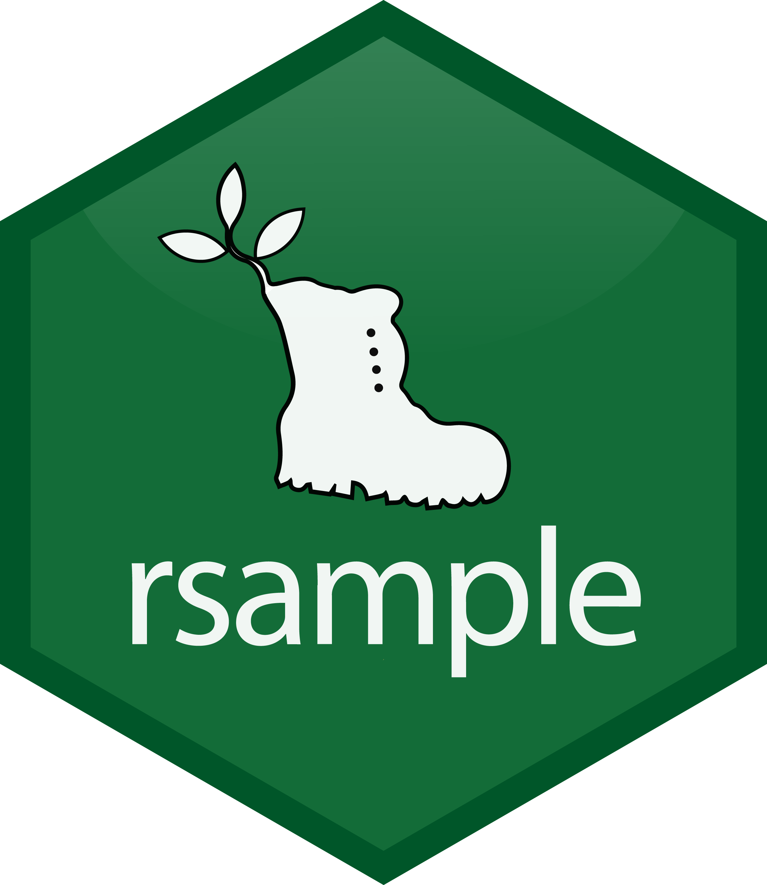
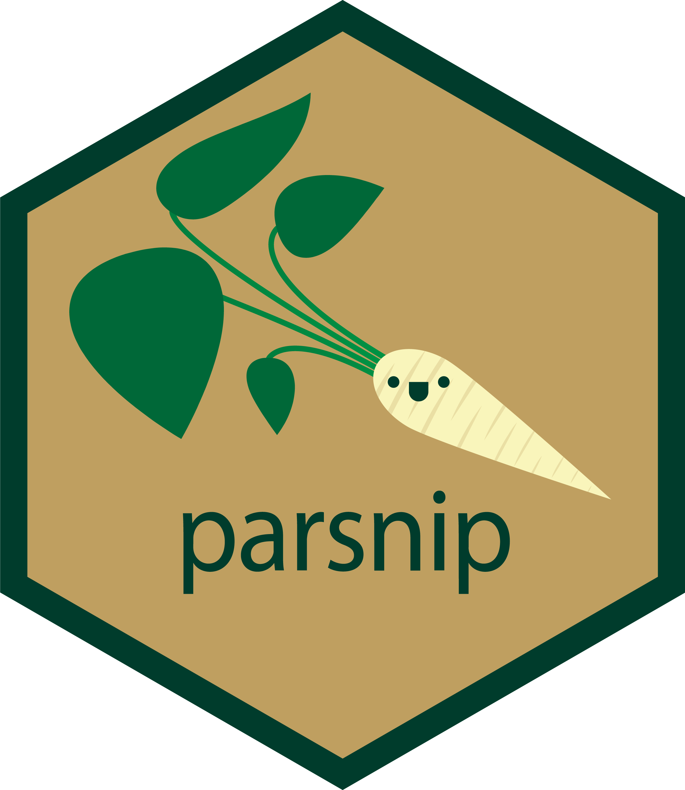
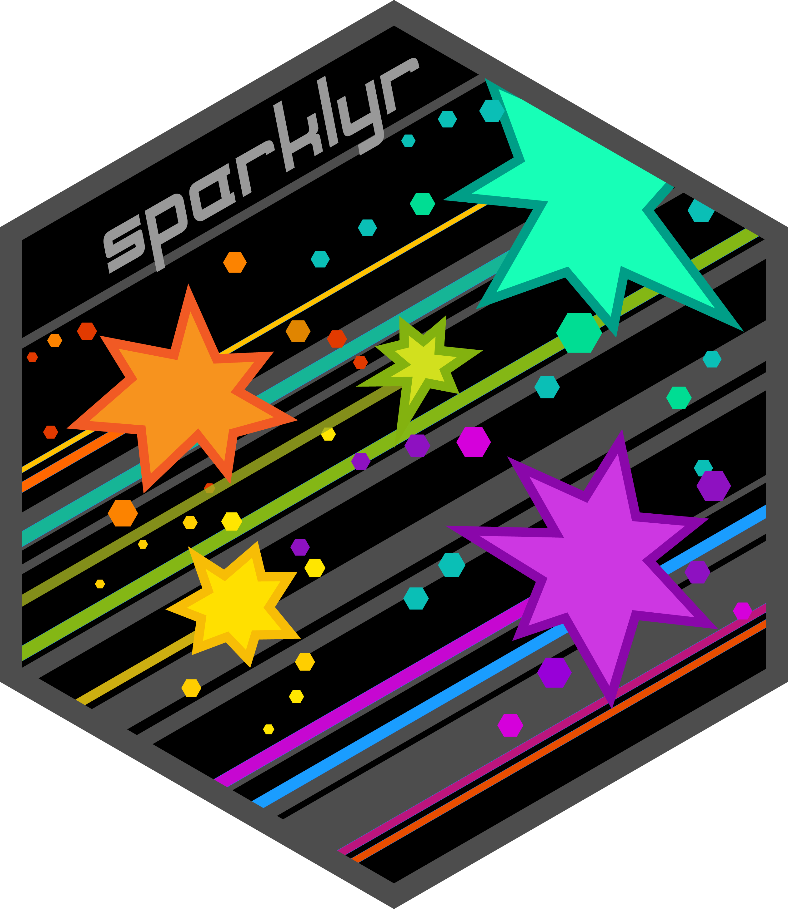
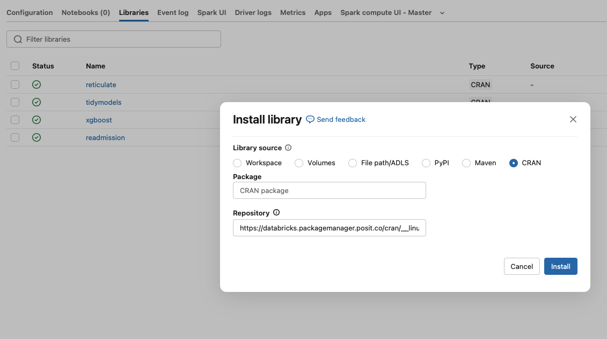
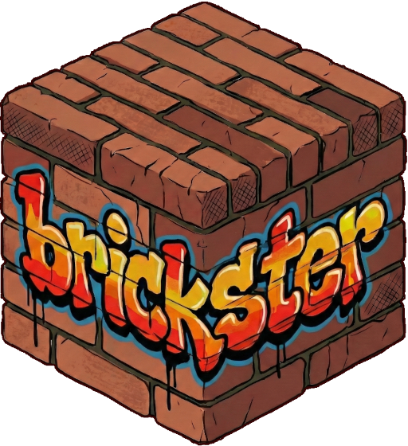
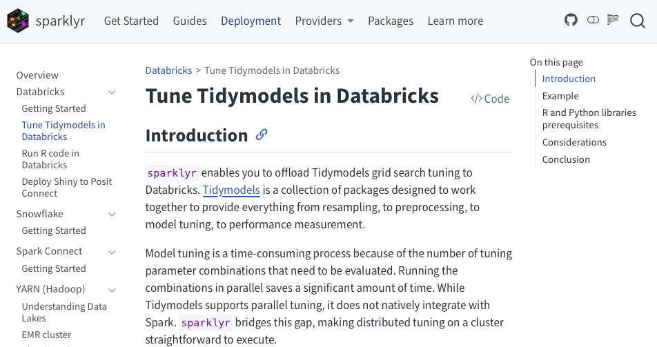

# {.title-block background-image="assets/title-slide-white.png" background-size="contain" background-color="white"}

```{=html}
<div class="title-block-inner">
  <h1>Prepare locally,<br>run remotely</h1>
  <p class="tagline">Easily scale <b>Tidymodels</b><br> on <b>Databricks</b> with <b>sparklyr</b></p>
  <p class="byline">Edgar Ruiz / Posit</p>
</div>
```

# Long running Grid Search {.dark-slide background-image="assets/slide-frame-dark.png" background-size="contain" background-color="#031042"}

```{=html}
<div class="eyebrow">The problem</div>
```


## For example {background-image="assets/slide-frame.png" background-size="contain" background-color="white"}

```{=html}
<div class="eyebrow">The problem</div>
```

{.absolute top=0 left=1116 width=105}

:::: {.columns}

::: {.column width="60%"}

```{=html}
<div class="stack-area stack-right">

  <div class="fragment fade-in-then-out" data-fragment-index="1">
    <div class="col-label">Hospital Readmissions</div>
    <div class="eq-wrap">
      <div class="equation eq-stack eq-sm">
        <div class="eq-row">
          <span class="op"></span><span class="num">10</span><span class="lab">re-samples</span>
        </div>
        <div class="eq-row">
          <span class="op">x</span><span class="num">100</span><span class="lab">combinations</span>
        </div>
        <div class="eq-row total">
          <span class="op">=</span><span class="num">1,000</span><span class="lab">model fits</span>
        </div>
      </div>
    </div>
  </div>

  <div>
    <div class="fragment" data-fragment-index="2">
      <div class="col-label">1K model fits</div>
      <div class="bench bench-sm">
        <div class="row"><div class="label plat"><i class="fa-brands fa-apple"></i></div><div class="bar" style="width:61px"></div><div class="time">11 min</div></div>
        <div class="row"><div class="label plat"><i class="fa-brands fa-windows"></i></div><div class="bar" style="width:339px"></div><div class="time">61 min</div></div>
        <div class="row"><div class="label plat"><i class="fa-brands fa-linux"></i></div><div class="bar" style="width:500px"></div><div class="time">90 min</div></div>
      </div>
    </div>
    <div class="fragment bigproc" data-fragment-index="3">
      It&rsquo;s a <span class="hl">&ldquo;big processing&rdquo;</span> problem
    </div>
  </div>

</div>
```

:::

::: {.column width="40%"}

:::{.sample-micro}
```r
readmission_splits <- initial_split(readmission, strata = readmitted)

readmission_folds <- vfold_cv(training(readmission_splits), 
                              strata = readmitted)

recipe_basic <- recipe(readmitted ~ ., data = training(readmission_splits)) |>
  step_mutate(
    race = factor(case_when(
      !(race %in% c("Caucasian", "African American")) ~ "Other",
      .default = race
    ))
  ) |>
  step_unknown(all_nominal_predictors()) |>
  step_YeoJohnson(all_numeric_predictors()) |>
  step_normalize(all_numeric_predictors()) |>
  step_dummy(all_nominal_predictors())
  
spec_bt <- boost_tree(
  mode = "classification",
  trees = 500,
  mtry = tune(), min_n = tune(),
  learn_rate = tune(), tree_depth = tune()
)

bt_grid <- grid_space_filling(
  mtry(range = c(5, 20)),
  min_n(),
  learn_rate(),
  tree_depth(),
  size = 100
)

local_results <- tune_grid(
  object = spec_bt,
  preprocessor = recipe_basic,
  resamples = readmission_folds,
  grid = bt_grid,
  control = control_grid()
)
```
:::

:::

::::

## The usual answers fall short {background-image="assets/slide-frame.png" background-size="contain" background-color="white"}

```{=html}
<div class="eyebrow">The problem</div>
```


:::{.lead}
Usual solutions have one or more of these **barriers**.
:::

```{=html}
<div class="cards cards-4">
  <div class="card-col">
    <div class="card c-green">
      <div class="icon"><span class="pix"><i></i><i></i><i></i><i></i></span></div>
      <p>Bound by cores</p>
    </div>
    <div class="subnote">Does not solve the problem</div>
  </div>
  <div class="card-col">
    <div class="card c-magenta">
      <div class="icon"><span class="glyph money">$$$</span></div>
      <p>Expensive</p>
    </div>
    <div class="subnote">Hard to get</div>
  </div>
  <div class="card-col">
    <div class="card c-blue">
      <div class="icon"><span class="glyph">R|&gt;</span></div>
      <p>Code re-write</p>
    </div>
    <div class="subnote">Time consuming</div>
  </div>
  <div class="card-col">
    <div class="card c-yellow">
      <div class="icon"><span class="stack"><i></i><i></i><i></i></span></div>
      <p>Complex</p>
    </div>
    <div class="subnote">Time consuming &amp; may need help</div>
  </div>
</div>
```

## The usual answers fall short {background-image="assets/slide-frame.png" background-size="contain" background-color="white"}

```{=html}
<div class="eyebrow">The problem</div>
```

```{=html}
<div class="summary">
  <div class="hdr">Solution</div>
  <div class="hdr">Solves?</div>
  <div class="hdr">Barrier</div>
  <div class="name fragment" data-fragment-index="1">Local machine</div>
  <div class="verdict fragment" data-fragment-index="1"><span class="mark no"></span></div>
  <div class="mini fragment" data-fragment-index="1">
      <div class="card c-green"><div class="icon"><span class="pix"><i></i><i></i><i></i><i></i></span></div></div>
  </div>
  <div class="name fragment" data-fragment-index="2">Grid computing</div>
  <div class="verdict fragment" data-fragment-index="2"><span class="mark ok"></span></div>
  <div class="mini fragment" data-fragment-index="2">
      <div class="card c-magenta"><div class="icon"><span class="glyph money">$$$</span></div></div>
      <div class="card c-blue"><div class="icon"><span class="glyph">R|&gt;</span></div></div>
  </div>
  <div class="name fragment" data-fragment-index="3">Spark cluster</div>
  <div class="verdict fragment" data-fragment-index="3"><span class="mark ok"></span></div>
  <div class="mini fragment" data-fragment-index="3">
      <div class="card c-yellow"><div class="icon"><span class="stack"><i></i><i></i><i></i></span></div></div>
      <div class="card c-blue"><div class="icon"><span class="glyph">R|&gt;</span></div></div>
  </div>
  <div class="name fragment" data-fragment-index="4">Databricks Notebooks</div>
  <div class="verdict fragment" data-fragment-index="4"><span class="mark no"></span></div>
  <div class="mini fragment" data-fragment-index="4">
      <div class="card c-green"><div class="icon"><span class="pix"><i></i><i></i><i></i><i></i></span></div></div>
  </div>
  <div class="name fragment" data-fragment-index="5">Databricks cluster</div>
  <div class="verdict fragment" data-fragment-index="5"><span class="mark ok"></span></div>
  <div class="mini fragment" data-fragment-index="5">
      <div class="card c-blue"><div class="icon"><span class="glyph">R|&gt;</span></div></div>
  </div>
</div>
```

## The usual answers fall short {background-image="assets/slide-frame.png" background-size="contain" background-color="white"}

```{=html}
<div class="eyebrow">The problem</div>
```

```{=html}
<div class="summary focus-mode">
  <div class="hdr">Solution</div>
  <div class="hdr">Solves?</div>
  <div class="hdr">Barrier</div>
  <div class="name">Local machine</div>
  <div class="verdict"><span class="mark no"></span></div>
  <div class="mini">
      <div class="card c-green"><div class="icon"><span class="pix"><i></i><i></i><i></i><i></i></span></div></div>
  </div>
  <div class="name">Grid computing</div>
  <div class="verdict"><span class="mark ok"></span></div>
  <div class="mini">
      <div class="card c-magenta"><div class="icon"><span class="glyph money">$$$</span></div></div>
      <div class="card c-blue"><div class="icon"><span class="glyph">R|&gt;</span></div></div>
  </div>
  <div class="name lit">Spark cluster</div>
  <div class="verdict lit"><span class="mark ok"></span></div>
  <div class="mini">
      <div class="card c-yellow"><div class="icon"><span class="stack"><i></i><i></i><i></i></span></div></div>
      <div class="card c-blue focus"><div class="icon"><span class="glyph">R|&gt;</span></div></div>
  </div>
  <div class="name">Databricks Notebooks</div>
  <div class="verdict"><span class="mark no"></span></div>
  <div class="mini">
      <div class="card c-green"><div class="icon"><span class="pix"><i></i><i></i><i></i><i></i></span></div></div>
  </div>
  <div class="name lit">Databricks cluster</div>
  <div class="verdict lit"><span class="mark ok"></span></div>
  <div class="mini">
      <div class="card c-blue focus"><div class="icon"><span class="glyph">R|&gt;</span></div></div>
  </div>
</div>
```

# Run the same code in Spark {.dark-slide background-image="assets/slide-frame-dark.png" background-size="contain" background-color="#031042"}

```{=html}
<div class="eyebrow">Removing the barrier</div>
```

## How should it work? {background-image="assets/slide-frame.png" background-size="contain" background-color="white"}

The ideal solution should fit right into your regular code workflow

```{=html}
<div class="eyebrow">Removing the barrier</div>
```

```{=html}
<div class="flow-cols">
  <div class="fl-col fragment" data-fragment-index="1">
    <div class="fl-head">Regular workflow</div>
    <div class="fl-row">
      
      <ul class="fl-cap">
        <li>Split data</li>
        <li>Create folds</li>
      </ul>
    </div>
    <div class="fl-row">
      
      <ul class="fl-cap">
        <li>Pre-process</li>
      </ul>
    </div>
    <div class="fl-row">
      
      <ul class="fl-cap">
        <li>Define model</li>
      </ul>
    </div>
    <div class="fl-row">
      
      <ul class="fl-cap">
        <li>Create grid</li>
        <li>Tune model</li>
        <li>Select model</li>
      </ul>
    </div>
  </div>
  <div class="fl-col fragment" data-fragment-index="2">
    <div class="fl-head">Using Spark</div>
    <div class="fl-row">
      
      <ul class="fl-cap">
        <li>Split data</li>
        <li>Create folds</li>
      </ul>
    </div>
    <div class="fl-row">
      
      <ul class="fl-cap">
        <li>Pre-process</li>
      </ul>
    </div>
    <div class="fl-row">
      
      <ul class="fl-cap">
        <li>Define model</li>
      </ul>
    </div>
    <div class="fl-row">
      
      <ul class="fl-cap">
        <li>Create grid</li>
      </ul>
    </div>
    <div class="fl-row hl-row">
      
      <ul class="fl-cap">
        <li class="hl">Tune model</li>
      </ul>
    </div>
    <div class="fl-row">
      
      <ul class="fl-cap">
        <li>Select model</li>
      </ul>
    </div>
  </div>
</div>
```

## How does it work?{background-image="assets/slide-frame.png" background-size="contain" background-color="white"}

```{=html}
<div class="eyebrow">Removing the barrier</div>
```

{.absolute top=0 left=1116 width=105}

:::{.lead}
A new function that supports the same tidymodels objects.
:::

:::: {.columns}

::: {.column width="46%"}
`tune_grid()`

:::{.sample-tiny}
```r
tune_grid(
  object = my_spec,
  preprocessor = my_recipe,
  resamples = my_resamples,
  grid = my_grid,
  control = control_grid()
)
```
:::
:::

::: {.column .fragment width="54%"}
`tune_grid_spark()`

:::{.sample-tiny}
```{.r code-line-numbers="1,8|2-6|7|"}
tune_grid_spark(
  object = my_spec,
  preprocessor = my_recipe,
  resamples = my_resamples,
  grid = my_grid,
  control = control_grid(),
  sc = spark_connection
)
```
:::
:::

::::


## But, how does it work?{background-image="assets/slide-frame.png" background-size="contain" background-color="white"}

The new function takes care of everything

```{=html}
<div class="eyebrow">Removing the barrier</div>
```

{.absolute top=0 left=1116 width=105}

```{=html}
<div class="flow">
  <div class="step s-blue fragment">
    <div class="chev"><span class="num">01</span></div>
    <h3>Uploads</h3>
    <p><b>Re-samples</b>, <b>model</b> and <b>recipe</b> objects are transmitted to Spark</p>
  </div>
  <div class="step s-magenta fragment">
    <div class="chev"><span class="num">02</span></div>
    <h3>Tunes in Spark</h3>
    <p>Every combination is fitted on a Spark task, and in real R</p>
  </div>
  <div class="step s-green fragment">
    <div class="chev"><span class="num">03</span></div>
    <h3>Collects</h3>
    <p>Results from Spark are compiled into a <code>tune_results</code> object</p>
  </div>
</div>
```

## A quick tip{.tip-table background-image="assets/slide-frame.png" background-size="contain" background-color="white"}

This method is sensitive to parallel settings in `parallel_over`

```{=html}
<div class="eyebrow">Removing the barrier</div>
```


{.absolute top=0 left=1116 width=105}

:::: {.columns}

::: {.column width="3%"}
:::

::: {.column width="40%"}

```{=html}
<br/>
<div class="stack-area stack-right fragment" data-fragment-index="1">

  <div>
    <div class="eq-wrap">
      <div class="equation eq-stack eq-sm">
        <div class="eq-row">
          <span class="op"></span><span class="num">10</span><span class="lab">re-samples</span>
        </div>
        <div class="eq-row">
          <span class="op">x</span><span class="num">100</span><span class="lab">combinations</span>
        </div>
        <div class="eq-row total">
          <span class="op">=</span><span class="num">1,000</span><span class="lab">model fits</span>
        </div>
      </div>
    </div>
  </div>


</div>
```


:::

::: {.column width="8%"}
:::

::: {.column width="40%"}
::: {.fragment data-fragment-index="2"}
| Spark Cluster          |
|:----------------------:|
| **32** cores available |
:::

```{=html}
<div class="fragment" data-fragment-index="3">
<table>
  <thead>
    <tr><th style="text-align: left;">Set to</th><th style="text-align: right;">Tasks</th></tr>
  </thead>
  <tbody>
    <tr class="fragment" data-fragment-index="4">
      <td style="text-align: left;"><code>"resamples"</code></td><td style="text-align: right;"><strong>10</strong></td>
    </tr>
    <tr class="fragment" data-fragment-index="5">
      <td style="text-align: left;"><code>"everything"</code></td><td style="text-align: right;"><strong>32</strong></td>
    </tr>
  </tbody>
</table>
</div>
```


:::


::::

## Considerations {.roomy-list background-image="assets/slide-frame.png" background-size="contain" background-color="white"}

```{=html}
<div class="eyebrow">Removing the barrier</div>
```

- **R and necessary packages must be installed on the cluster**

- OS, R, and package versions may cause slight variations from local runs

- Pulling predictions roughly doubles total data transfer

- Use SparkML if data exceeds local memory


# The rest of the puzzle {.dark-slide background-image="assets/slide-frame-dark.png" background-size="contain" background-color="#031042"}

```{=html}
<div class="eyebrow">Databricks</div>
```


## Ideal for running remotely {background-image="assets/slide-frame.png" background-size="contain" background-color="white"}

```{=html}
<div class="eyebrow">Databricks</div>
```

{.absolute top=12 left=1126 width=95}

```{=html}
<div class="iconlist">

  <div class="il-row fragment" data-fragment-index="1">
    <svg class="il-art" viewBox="0 0 120 120" aria-hidden="true">
      <rect x="10" y="16" width="46" height="26" rx="5" class="fill-navy"/>
      <rect x="10" y="50" width="46" height="26" rx="5" class="fill-navy"/>
      <rect x="10" y="84" width="46" height="26" rx="5" class="fill-navy"/>
      <circle cx="20" cy="29" r="4" class="fill-green"/>
      <circle cx="20" cy="63" r="4" class="fill-green"/>
      <circle cx="20" cy="97" r="4" class="fill-green"/>
      <path d="M74 40 a24 24 0 1 1 -8 18" class="stroke-blue"/>
      <path d="M62 40 h14 v-14" class="stroke-blue"/>
    </svg>
    <p><b>Cluster management</b> - Very easy to spin up and tear down Spark clusters</p>
  </div>

  <div class="il-row fragment" data-fragment-index="2">
    <svg class="il-art" viewBox="0 0 120 120" aria-hidden="true">
      <rect x="6" y="26" width="48" height="36" rx="5" class="fill-navy"/>
      <rect x="20" y="66" width="20" height="8" class="fill-navy"/>
      <rect x="66" y="26" width="48" height="36" rx="5" class="stroke-navy"/>
      <path d="M14 86 h92" class="stroke-blue dash"/>
      <circle cx="30" cy="86" r="6" class="fill-magenta"/>
      <circle cx="90" cy="86" r="6" class="fill-magenta"/>
    </svg>
    <p><b>Remote execution</b> - Databricks Connect lets you execute jobs remotely from your favorite IDE</p>
  </div>

  <div class="il-row fragment" data-fragment-index="3">
    <svg class="il-art" viewBox="0 0 120 120" aria-hidden="true">
      <circle cx="60" cy="60" r="42" class="fill-navy"/>
      <text x="60" y="78" class="il-glyph">R</text>
      <circle cx="99" cy="24" r="13" class="fill-green"/>
      <path d="M93 24 h12 M99 18 v12" class="stroke-navy"/>
    </svg>
    <p><b>R Support</b> - Native support for the R runtime and managed package installation (<b>Dedicated</b> mode only)</p>
  </div>

</div>
```


## Working with Databricks {background-image="assets/slide-frame.png" background-size="contain" background-color="white"}

```{=html}
<div class="eyebrow">Databricks</div>
```

{.absolute top=12 left=1126 width=95}

```{=html}
<div class="dbdiag">

  <div class="rcard rcard-lg">
    <div class="cardlabel">My laptop</div>
    <i class="fa-brands fa-r-project"></i>
    
  </div>

  <div class="wires">
    <div class="wirehex fragment" data-fragment-index="1">
      
    </div>
    <div class="wlabel fragment" data-fragment-index="1">
      Uploads <b>re-samples</b>, <b>model</b> and <b>recipe</b>
    </div>
    <div class="wire fragment" data-fragment-index="1">
      <span class="line"></span><span class="head right"></span>
    </div>
    <div class="net">Internet</div>
    <div class="wire fragment" data-fragment-index="2">
      <span class="head left"></span><span class="line"></span>
    </div>
    <div class="wlabel fragment" data-fragment-index="2">
      Downloads <b>results</b>
    </div>
    <div class="wirehex fragment" data-fragment-index="2">
      
    </div>
  </div>

  <div class="node cluster">
    <div class="dbhead"><span>Databricks</span></div>
    <div class="inner">
      
      <div class="workers">
        <div class="rcard rcard-sm">
          <i class="fa-brands fa-r-project"></i>
          
        </div>
        <div class="rcard rcard-sm">
          <i class="fa-brands fa-r-project"></i>
          
        </div>
        <div class="rcard rcard-sm">
          <i class="fa-brands fa-r-project"></i>
          
        </div>
      </div>
      <div class="pp">Parallel processing</div>
    </div>
  </div>

</div>
```

## Installing packages {background-image="assets/slide-frame.png" background-size="contain" background-color="white"}

```{=html}
<div class="eyebrow">Databricks</div>
```

{.absolute top=12 left=1126 width=95}

:::{.lead}
Use the web UI to manually add the needed packages
:::

{.absolute top=200 left=250 width=800}


## Script the installation {background-image="assets/slide-frame.png" background-size="contain" background-color="white"}

```{=html}
<div class="eyebrow">Databricks</div>
```

{.absolute top=0 left=1116 width=105}

:::{.lead}
`brickster` enables installing the packages using code
:::

:::{.sample-small}
```r
library(brickster)

r_libs <- libraries(
  lib_cran("reticulate", repo = repo),
  lib_cran("tidymodels", repo = repo),
  lib_cran("xgboost", repo = repo)
)

db_libs_install("[MY CLUSTER'S ID]", r_libs)
```
:::

## Script the installation {background-image="assets/slide-frame.png" background-size="contain" background-color="white"}

```{=html}
<div class="eyebrow">Removing the barrier</div>
```

{.absolute top=0 left=1116 width=105}

:::{.lead}
Python's `rpy2` package is also needed, but `brickster` can also take care of that
:::

:::{.sample-small}
```r
py_lib <- lib_pypi("rpy2") |>
  libraries()

db_libs_install("[MY CLUSTER'S ID]", py_lib)

```
:::

## Back to the example {background-image="assets/slide-frame.png" background-size="contain" background-color="white"}

```{=html}
<div class="eyebrow">Databricks</div>
```

{.absolute top=12 left=1126 width=95}

::::::::: {.columns}

:::::::: {.column width="58%"}

::::::: {.code-stack}

:::::: {.fragment .fade-out .sample-mini fragment-index=1}
```r
tune_grid(
  object = spec_bt,
  preprocessor = recipe_basic,
  resamples = readmission_folds,
  grid = bt_grid,
  control = control_grid()
)
```
::::::

:::::: {.fragment .fade-out fragment-index=2}
::::: {.fragment .sample-mini fragment-index=1}
```r
tune_grid_spark(
  sc = sc,
  object = spec_bt,
  preprocessor = recipe_basic,
  resamples = readmission_folds,
  grid = bt_grid,
  control = control_grid()
)
```
:::::
::::::

:::::: {.fragment .sample-mini fragment-index=2}
```r
tune_grid_spark(
  sc = sc,
  object = spec_bt,
  preprocessor = recipe_basic,
  resamples = readmission_folds,
  grid = bt_grid,
  control = control_grid(
    parallel_over = "everything"
    )
)
```
::::::

:::::::

::::::::

:::::::: {.column width="42%"}

```{=html}
<div class="bench bench-sm">
  <div class="row"><div class="label plat"><i class="fa-brands fa-apple"></i></div><div class="bar" style="width:35px"></div><div class="time">11 min</div></div>
  <div class="row"><div class="label plat"><i class="fa-brands fa-windows"></i></div><div class="bar" style="width:197px"></div><div class="time">61 min</div></div>
  <div class="row"><div class="label plat"><i class="fa-brands fa-linux"></i></div><div class="bar" style="width:290px"></div><div class="time">90 min</div></div>
  <div class="row fragment" data-fragment-index="1"><div class="label plat"></div><div class="bar fast" style="width:16px"></div><div class="time">5 min</div></div>
  <div class="row fragment" data-fragment-index="2"><div class="label plat"></div><div class="bar fast" style="width:9px"></div><div class="time">2.8 min</div></div>
</div>
```

::::::::

:::::::::


## Where to read more {.links .roomy-list background-image="assets/slide-frame.png" background-size="contain" background-color="white" .roomy-list}

```{=html}
<div class="eyebrow">Links</div>
```

[spark.posit.co/deployment/databricks_tune_tidymodels](https://spark.posit.co/deployment/databricks_tune_tidymodels)

{.absolute top=200 left=200 width=850}


## Thank you {.thanks background-image="assets/thank-you.png" background-size="contain" background-color="white"}

{.absolute top=258 left=48 width=360}

